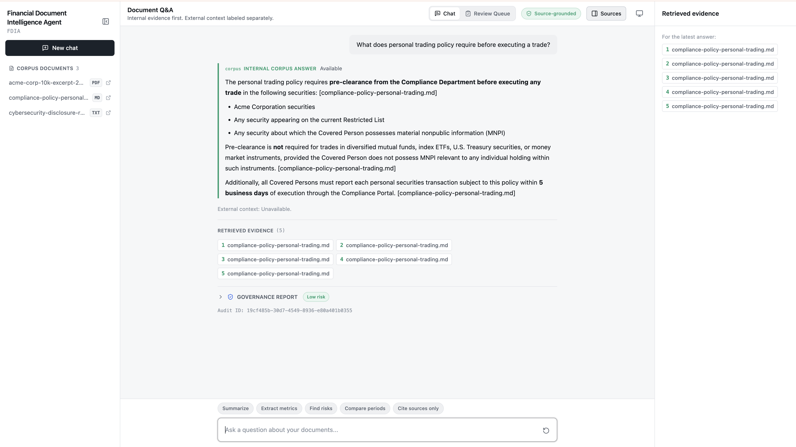
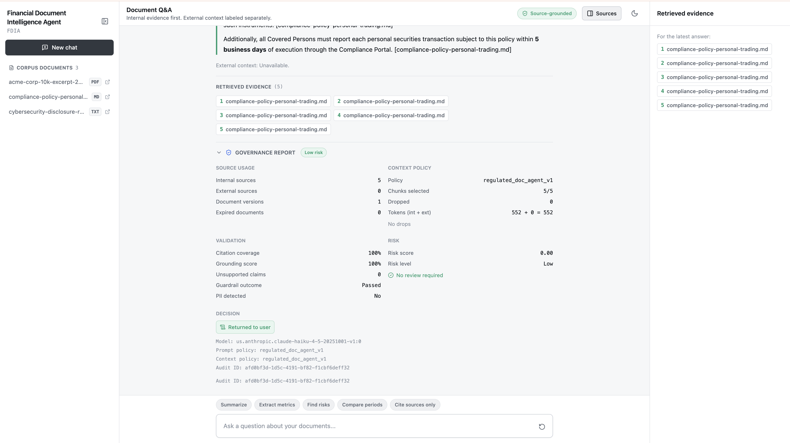
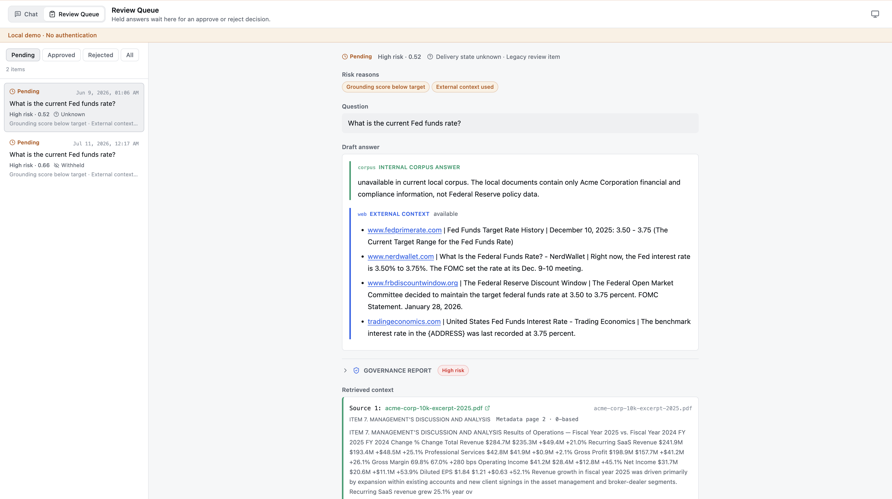

# Financial Document Intelligence Agent

A Python RAG agent for regulated-document workflows in finance and compliance.

This project answers questions over a local corpus of financial and policy documents using LangChain, Chroma, and AWS Bedrock. It uses retrieval over local documents as the primary source of truth and can fall back to Tavily for clearly separated public-web context when the local corpus does not contain the needed information.

The goal is to demonstrate the architecture behind document intelligence systems used in compliance, investment research, and analyst workflows:
- retrieval over dense document sets
- source-aware answers from internal documents
- optional public-web research as supplemental context
- agent-based multi-step reasoning across tools

## Run the web UI

To make the browser visualization work, run these two commands in two separate
terminals:

```bash
# Terminal 1: backend API, from the repo root
python -m uvicorn api:app --reload
```

```bash
# Terminal 2: frontend UI, from the repo root
cd frontend && npm run dev
```

Then open `http://localhost:5173` in your browser. The frontend needs the
backend running at `http://127.0.0.1:8000`; otherwise the document sidebar will
not load.

### Frontend preview

**Grounded answer with retrieved source evidence**



**Governance validation and decision trace**



## Why this project

In regulated workflows, a plain chatbot answer is not enough. Users need answers tied back to source material they can inspect.

This project is designed around that idea:
- local documents are the primary source of truth
- answers should be grounded in retrieved evidence
- external web results should be labeled as external context
- document metadata should support traceability and review

This is not a production compliance system or legal tool. It is a portfolio project that demonstrates the engineering patterns behind one.

---

## What it currently does

- [x] Loads a local document corpus from `/docs` (10 formats / 14 extensions: .pdf, .md, .txt, .docx, .xlsx, .xls, .html, .htm, .csv, .pptx, .eml, .msg, .json, .jsonl)
- [x] Chunks and embeds documents into a persistent Chroma vector store
- [x] Uses an agent to choose between local retrieval and web search
- [x] Returns answers in a structured Result Summary format
- [x] Preserves source metadata from local documents
- [x] Clearly separates internal corpus answers from external web context
- [x] Refuses to substitute one company's data for another
- [x] Web results include clickable markdown links with source, date, headline
- [x] Gracefully handles missing Tavily API key (web search disabled, no crash)
- [x] Thread-safe Chroma singleton for parallel tool calls
- [x] Supports CLI, Gradio fallback, and React/TypeScript interfaces
- [x] Streams workflow status while the answer is generated and validated, then releases the buffered, governance-decided answer in one update (drafts and withheld source excerpts are never transmitted before the decision)
- [x] Returns a safe, stable error contract from the chat API (`code` + generic message + opaque correlation id); full exception detail stays in the server log
- [x] Fails startup explicitly when a governance policy YAML file is present but invalid; a missing policy file uses the documented built-in defaults
- [x] Review-queue writes are atomic per file (temp file + fsync + rename) and race-safe within one process; the pending→terminal move is not a database transaction and the CLI racing the API from a second process is unprotected
- [x] Caps Gradio chat history to prevent stale formatting from older turns
- [x] Exposes retrieved chunk metadata in the React answer view
- [x] Extracts PDF table text into retrievable chunks when PyMuPDF detects tables
- [x] Tracks document version metadata and supports retrieval filters by company, filing type, and year
- [x] Writes JSONL audit logs for queries, retrieved sources, and response traces
- [x] Includes a deterministic evaluation runner for retrieval, citations, grounding, unsupported claims, routing, and latency
- [x] Wraps the agent in a governance layer: context policy admission, runtime grounding validation, per-answer governance report, and document change impact analysis
- [x] Holds answers that meet a mandatory-review policy condition in a human review queue — either weighted risk at/above the 0.75 threshold or grounding strictly below the 0.50 review floor, each with an explicit reason code (a low weighted-risk answer can still be held by the floor). Hold or flag mode via `HUMAN_REVIEW_HOLD`; resolved in the React reviewer workspace or the CLI (approve/reject with an optional note — no draft editing yet)
- [x] Optional LangSmith run tracing (off by default); every traced run carries the answer's `audit_id`, joining it to the audit log and governance report
- [x] 252 tests covering multi-format ingestion, per-format loaders, PII redaction, tools, agent behavior, auditability, API responses and error sanitization, evaluation metrics, governance reporting and policy validation, context policy admission, runtime grounding validation, streaming leak prevention, document change impact analysis, the human review queue (routes, atomicity, races, demo seeding), and thread safety

## Best-fit use cases

The current implementation is best suited for:
- SEC 10-K and 10-Q filings
- earnings call transcripts
- internal compliance manuals
- policy documents
- governance and controls documentation
- research notes
- board minutes, committee charters, proxy statements, training decks (DOCX/PPTX)
- control matrices, risk registers, audit trails, KYC records (XLSX/CSV)
- regulatory correspondence, email archives (EML/MSG)
- XBRL inline filings, API data exports (JSON/JSONL)
- other dense PDF / markdown / text corpora

---

## Quickstart

```bash
cp .env.example .env
# Edit .env with your AWS credentials and optional Tavily API key

pip install -r requirements.txt
cd frontend && npm install && cd ..

# Add documents to the corpus (sample docs are included)
# cp my-docs/*.pdf docs/

python ingest.py
python cli.py -q "What does the personal trading policy require before executing a trade?"
```

Other ways to run:

```bash
python cli.py                    # interactive CLI mode
python app.py                    # Gradio fallback UI
python -m uvicorn api:app --reload  # React API, run from repo root
cd frontend && npm run dev          # React UI, run in a second terminal
python -m pytest tests/ -v       # run tests
python eval_runner.py            # run evaluation dataset
python scripts/demo_walkthrough.py  # guided governance demo (see below)
```

### Example output

```text
## Result Summary

**Internal Corpus Answer:** Available in current local corpus.

According to Acme Corporation's personal trading policy, all covered persons
must obtain pre-clearance from the Compliance Department before executing any
trade in Acme Corporation securities, securities on the Restricted List, or any
security about which they possess material nonpublic information (MNPI).
Pre-clearance requests must be submitted at least 24 hours before the intended
trade date, and approvals are valid for 48 hours.
[compliance-policy-personal-trading.md]

**External Context:** Unavailable.
```

The agent uses a structured **Result Summary** format for every answer:
- **Internal Corpus Answer** — grounded in local documents with source citations
- **External Context** — clearly separated web results, or marked unavailable

---

## Guided demo

One command walks the governance story end to end, pausing between acts:

```bash
python scripts/demo_walkthrough.py
```

1. **A grounded answer** — one real query, then the governance report behind it: which chunks the context policy admitted or dropped (and why), grounding score, citation coverage, risk score, and the routing decision.
2. **A held answer** — a deliberately ungrounded draft (fabricated numbers, citation to a file that was never retrieved) is validated by the real pipeline under the normal policy; the mandatory grounding floor holds it: the user sees a held notice instead of the draft, the full draft lands in the review queue with its evidence and reason codes, and the reviewer CLI approves it. No thresholds are modified.
3. **Drift, caught** — the eval baseline is diffed against a perturbed temp copy (the real `eval/baseline.json` is untouched), producing the exact `scripts/eval_diff.py` output an operator sees when a metric moves, a case flips pass/fail, or latency shifts. Add `--live-eval` to run the real eval against Bedrock instead of the offline diff.

Acts 1–2 need AWS credentials and an ingested corpus; Act 3 in default mode needs neither. `--no-pause` runs straight through. The demo's one persistent side effect is intentional — Act 2 writes a real item into `review_queue/` (gitignored runtime state; a clean clone starts with an empty queue). Seed or reset local demo queue data with `python scripts/review_queue.py seed --reset`.

---

## Architecture

```text
                    ┌──────────────────────────────┐
   User question ──▶│        Agent Executor        │
                    │     (AWS Bedrock model)      │
                    └───────────┬──────────┬───────┘
                                │          │
                     ┌──────────▼───┐  ┌───▼──────────┐
                     │ Local Search │  │  Web Search  │
                     │    Tool      │  │    Tool      │
                     └───────┬──────┘  └──────────────┘
                             │
                    ┌────────▼─────────┐
                    │ Chroma Vector DB │
                    └────────┬─────────┘
                             │
                  Embedded chunks from /docs

Ingestion:   /docs ──▶ loader ──▶ splitter ──▶ embed ──▶ Chroma
Query:       question ──▶ agent ──▶ tool(s) ──▶ observe ──▶ answer
```

The governance layer wraps that agent loop. Context policy decides what reaches
the model before retrieval returns; grounding, risk, and the report run after the
answer is generated:

```text
question
   │
   ▼
[context policy] ── admits/drops chunks by token budget, freshness, source
   │
   ▼
   agent loop (local_search / web_search ──▶ Bedrock model)
   │
   ▼
[grounding validation] ── citation coverage, grounding score, unsupported claims
   │
   ▼
[risk scorer] ── 3-signal score; blocked answers scored categorically (risk=high)
   │
   ▼
[governance report] ── audit ID, source usage, validation, risk, decision
   │
   ▼
answer  +  governance report  (API, React, CLI summary)  +  JSONL audit log
```

### Components

**Agent Executor**
Given a question, the agent decides which tool to call, inspects the result, and determines whether it has enough context to answer.

**Local Search Tool**
Wraps the Chroma retriever. The agent uses it to search the internal document corpus and return relevant chunks with source metadata.

**Web Search Tool**
Uses Tavily for supplemental public-web context. In finance-oriented workflows, this should be treated as external context, not a replacement for internal evidence.

**Governance path**
Amazon Bedrock Guardrails are wired end-to-end. The policy ([policies/guardrails-policy.md](policies/guardrails-policy.md)) defines denied topics (personalized investment advice, legal opinions, MNPI requests), PII anonymization (email, phone, SSN, card, address), and contextual grounding/relevance thresholds. Provision once with [scripts/setup_guardrail.py](scripts/setup_guardrail.py), then set `BEDROCK_GUARDRAIL_ID` and `BEDROCK_GUARDRAIL_VERSION` in the environment. When the guardrail intervenes, the agent surfaces a structured "blocked by policy" answer, suppresses the external-web fallback, and writes `guardrail_outcome="blocked"` into the audit log. The eval runner scores `guardrail_block_accuracy` from a denied-topic probe case so regressions in enforcement are visible.

---

## AI Governance Layer

The project wraps the document agent in a governance layer. It controls what information enters the model, validates whether each answer is grounded in retrieved evidence, scores risk, and produces a governance report for every answer, persisted with the append-only JSONL audit record (a local file, not tamper-proof storage). The report is visible in the API response, the React panel, and a one-line CLI summary, and the full record is written to the JSONL audit log.

The point is to make each answer defensible: you can see which chunks were admitted or dropped and why, how well the answer is grounded, what the risk decision was, and which past answers depend on a document that just changed.

Currently supports:

- governance report per answer (audit ID, source usage, validation, risk, decision)
- context policy admission with drop reasons and token budgets
- runtime grounding validation — deterministic and lexical (citation-string matching plus numeric-token support), not semantic entailment (citation coverage, grounding score, unsupported numeric claims)
- categorical block scoring (blocked answers report risk=high, validation=N/A)
- document change impact analysis CLI (`scripts/document_impact.py`) — same-document changed-chunk analysis against past answers; not a two-period filing comparison
- human review queue with a reachable mandatory-review policy: `held_for_review` routing driven by the weighted 0.75 threshold or the 0.50 grounding floor (explicit reason codes in the report and queue item), hold or flag mode gated by `HUMAN_REVIEW_HOLD`, CLI approve/reject via `scripts/review_queue.py`, and a reviewer workspace in the React UI over the `/api/reviews` routes
- internal-first retrieval policy
- external context separation
- document version and chunk traceability
- Bedrock Guardrails for denied topics and PII handling
- JSONL audit logs for query and retrieval traces
- deterministic evaluation for grounding, citations, routing, and drift (32-case dataset with a frozen baseline)
- optional LangSmith run tracing, joined to the audit log by `audit_id`

Planned next: the financial filing comparison workflow (see the roadmap under "What would make this more production-like"). Document-level permissions — formerly "Phase 6" — are deferred until after the comparison workflow and basic authentication.

The governance modules live in [governance/](governance/). The full design doc and phase-by-phase build log are kept as local working notes outside the public repo.

---

## Review workspace

The React UI has a second workspace for working the human review queue. A "Review Queue" entry in the top bar switches between chat and review; the switch is plain local state (no router, no deep links, and a refresh returns to chat).



*The items and risk labels in this screenshot predate the current risk policy. Generate equivalent local demo state with `python scripts/review_queue.py seed` — one pending, one approved, and one rejected item produced through the real validation and resolution path.*

What it does:

- lists queue items by status (Pending / Approved / Rejected / All), in the server's order
- shows the full item: risk signals, the original question, the held draft rendered with the same rules as a chat answer, the governance report, the retrieved context with links into the corpus, and the item's identifiers
- records approve/reject decisions with an optional reviewer note behind a confirmation dialog
- shows whether the answer was withheld before delivery (the `wasWithheld` snapshot; items written before that field existed read as "delivery state unknown")

Deliberate limits: this is a local demo surface. There is no authentication, no reviewer identity, no assignment, and no SLA; the only actions are approve and reject with an optional note (no draft editing); approving a draft does not deliver it to the original requester — a decision only moves the item between queue files and stamps `reviewedAt` plus the note. Persistence is local JSONL: writes are atomic per file and race-safe within one process, but the pending→terminal move is not a transaction and a second process (e.g. the CLI racing the API) is unprotected. A clean clone starts with an empty queue; `python scripts/review_queue.py seed` creates demo items. The workspace banner states the auth limits.

The API behind it:

| Route | Purpose |
| --- | --- |
| `GET /api/reviews` | List review items by `status` query param (`pending` default, `approved`, `rejected`, `all`). Pending sorts oldest first; resolved items sort most recently reviewed first. |
| `GET /api/reviews/{review_id}` | Full item detail across all statuses. Joins the audit log by `auditId` and returns only the record's `governance_report`. |
| `POST /api/reviews/{review_id}/approve` | Approve a pending item. Body `{"note": "..."}` is optional. |
| `POST /api/reviews/{review_id}/reject` | Reject a pending item, same body. |

Responses are allowlisted DTOs: corpus-relative paths only (the stored absolute `source` path never leaves the server), `404` for unknown ids, `409` when the item was already resolved, `422` for invalid status values or a malformed body.

---

## Tech Stack

| Layer            | Technology                          |
| ---------------- | ----------------------------------- |
| Language         | Python 3.10                         |
| Orchestration    | LangChain                           |
| LLM              | Claude Haiku 4.5 via AWS Bedrock    |
| Embeddings       | Titan Embeddings v2 via AWS Bedrock |
| Vector Store     | Chroma                              |
| Document Parsing | PyMuPDF (PDF), python-docx (DOCX), openpyxl (XLSX), BeautifulSoup4 + lxml (HTML), python-pptx (PPTX), extract-msg (.msg), stdlib (TXT/MD/CSV/EML/JSON) |
| Web Research     | Tavily Search / Research            |
| Interface        | CLI + Gradio + React/TypeScript     |

---

## Example finance/compliance workflows

### 1. Filing Q&A

**Question:**
"What are Acme Corp's key risk factors?"

**Expected behavior:**
The agent searches the local corpus, retrieves risk-factor chunks from the 10-K PDF, and answers with page-level citations.

### 2. Policy lookup

**Question:**
"What does the compliance policy say about blackout periods for personal trading?"

**Expected behavior:**
The agent retrieves the relevant section from the compliance policy markdown and answers using grounded context.

### 3. Cross-document analysis

**Question:**
"How do the cybersecurity risks in the 10-K compare to the trends described in the internal research note?"

**Expected behavior:**
The agent retrieves relevant chunks from both the filing and the research note and synthesizes a comparison.

### 4. Internal + external context

**Question:**
"Compare Acme Corp's risk disclosures with any recent public news about cybersecurity incidents."

**Expected behavior:**
The agent retrieves local evidence first, then uses web search for clearly separated external context.

---

## Project Structure

```text
ReAct-RAG/
├── config.py        # central config (Bedrock models, chunking, paths)
├── ingest.py        # load → chunk → embed → persist (Chroma)
├── loaders/         # format-handler registry + per-format loaders
│   ├── __init__.py        # auto-imports all handler modules
│   ├── registry.py        # FormatHandler + register / handler_for / supported_extensions
│   ├── pii.py             # email/SSN/card/phone regexes + redact / should_redact
│   ├── tables.py          # format_table_rows + per-format extract_*_tables helpers
│   ├── common.py          # humanize_stem (filename → human title with acronym preservation)
│   ├── pdf.py / markdown.py / text.py
│   ├── docx.py / excel.py / html.py / csv.py
│   └── pptx.py / email_doc.py / json_doc.py
├── tools.py         # local_search (Chroma) + web_search (Tavily, optional)
├── audit.py         # retrieved-source extraction + JSONL audit logging
├── agent.py         # LangChain agent (LangGraph + tool-calling loop)
├── eval_runner.py   # deterministic evaluation metrics and report
├── cli.py           # CLI (single query + interactive mode)
├── app.py           # Gradio fallback chat UI
├── api.py           # FastAPI backend for the React UI
├── eval/            # sample questions, expectations, and frozen baseline.json for drift checks
├── frontend/        # React + TypeScript + Tailwind UI (chat + review workspaces)
├── docs/            # sample docs (.md, .txt, .pdf) — corpus only; never indexed: policies/
├── policies/        # safety policy docs (e.g. guardrails-policy.md) — outside corpus
├── scripts/         # operator scripts (setup_guardrail.py, eval_diff.py, document_impact.py, review_queue.py, demo_walkthrough.py)
├── chroma_db/       # persistent vector store
├── governance/      # governance layer (report, grounding, risk, context policy, impact, review queue)
│   ├── governance_report.py  # per-answer report assembly
│   ├── grounding_validator.py # runtime citation + claim grounding
│   ├── risk_scorer.py        # 3-signal risk score + categorical block override
│   ├── context_policy.py     # chunk admission, token budgets, drop reasons
│   ├── impact.py             # document change diff + audit log scan
│   └── review_queue.py       # file-backed human review queue (enqueue/list/approve/reject + cross-status reads)
├── tests/           # 252 tests (ingest, per-format loaders, registry, PII, tools, agent, auditability, API + error sanitization, eval, guardrails, governance + policy validation, streaming, human review queue + atomicity + seed, thread safety)
│   ├── test_ingest.py
│   ├── test_tools.py
│   ├── test_agent.py
│   ├── test_audit.py
│   ├── test_api.py
│   ├── test_eval_runner.py
│   ├── test_guardrails.py
│   ├── test_governance_report.py
│   ├── test_grounding_validator.py
│   ├── test_risk_scorer.py
│   ├── test_context_policy.py
│   ├── test_document_impact.py
│   ├── test_review_queue.py
│   ├── test_agent_review.py
│   ├── test_loaders_registry.py
│   ├── test_pii_redaction.py
│   └── test_loader_{docx,excel,html,csv,pptx,email,json}.py
├── requirements.txt # dependencies
└── .env.example     # template for environment variables
```

---

## Environment and access

| Variable                | Required | Notes                                                    |
| ----------------------- | -------- | -------------------------------------------------------- |
| `AWS_ACCESS_KEY_ID`     | Yes*     | For local development if not using a profile or IAM role |
| `AWS_SECRET_ACCESS_KEY` | Yes*     | For local development if not using a profile or IAM role |
| `AWS_REGION`            | Yes      | Example: `us-east-1`                                     |
| `CHAT_MODEL_ID`         | No       | Bedrock chat model. Default `us.anthropic.claude-haiku-4-5-20251001-v1:0` |
| `EMBEDDING_MODEL_ID`    | No       | Bedrock embedding model. Default `amazon.titan-embed-text-v2:0` |
| `TAVILY_API_KEY`        | No       | Needed only for web search                               |
| `BEDROCK_GUARDRAIL_ID`  | No       | Enables Bedrock Guardrails when set; unset means guardrails are off |
| `BEDROCK_GUARDRAIL_VERSION` | No   | Guardrail version to apply. Required alongside `BEDROCK_GUARDRAIL_ID` |
| `BEDROCK_GUARDRAIL_TRACE` | No     | Guardrail trace level. Default `ENABLED`                 |
| `CHROMA_COLLECTION`     | No       | Defaults to `documents`                                  |
| `AUDIT_LOG_PATH`        | No       | Defaults to `audit_logs/query_audit.jsonl`               |
| `HUMAN_REVIEW_HOLD`     | No       | Default `true`. When true, high-risk answers are withheld and replaced with a review notice; when false, the answer returns but the item is still enqueued for review |
| `REVIEW_QUEUE_DIR`      | No       | Review queue directory. Defaults to `review_queue/`, anchored to the module dir like `AUDIT_LOG_PATH` |
| `LANGSMITH_TRACING`     | No       | Set to `true` to send run traces to LangSmith. Off by default; the agent behaves identically when unset |
| `LANGSMITH_API_KEY`     | No       | LangSmith API key. Required only when `LANGSMITH_TRACING=true` |
| `LANGSMITH_PROJECT`     | No       | LangSmith project name for traces. Defaults to `default`. Every traced run carries the answer's `audit_id` in its metadata, joining it to the audit log and governance report |
| `PII_REDACT_AT_INGEST`  | No       | Global PII redaction on load. Default `false`            |
| `PII_REDACT_TABULAR_AT_INGEST` | No | Tabular-only PII redaction for CSV/XLSX. Default `true`  |

\* In deployed environments, IAM roles are the preferred access pattern for Bedrock and related AWS services.

---

## Demo setup

For the strongest demo, populate `/docs` with public finance/compliance materials such as SEC 10-K or 10-Q filings, earnings call transcripts, compliance handbooks, or governance documentation. Then:

1. Run `python ingest.py` to build the Chroma vector store
2. Test at least one local-only question and one mixed local + web question
3. Verify that answers clearly separate internal corpus evidence from external web context
4. Confirm source metadata is preserved if you want to demonstrate traceability

React UI demo:

Use the two-terminal web UI commands at the top of this README. The backend
must be running before the frontend can load the document sidebar.

---

## Verified behavior

The following behaviors were manually validated in the current implementation:

- Bedrock-based agent invocation works end to end
- Local retrieval returns grounded answers for known-answer queries
- The agent reports missing information instead of fabricating answers
- Web search degrades gracefully when Tavily is not configured
- Mixed local + web questions keep external context clearly separated
- The agent does not substitute one company's filings for another

### Verified example queries

```bash
# Local corpus — 10-K filing (PDF)
python cli.py -q "What are Acme Corp's key risk factors?"

# Local corpus — compliance policy (.md)
python cli.py -q "What does the compliance policy say about blackout periods for personal trading?"

# Local corpus — research note (.txt)
python cli.py -q "What does the internal research note say about cybersecurity disclosure trends?"

# Negative test — company not in corpus
python cli.py -q "What do NVIDIA's latest filings say about key risk factors?"

# Mixed local + web
python cli.py -q "Compare Acme Corp's risk disclosures with any recent public news about cybersecurity incidents."

# Web-only fallback
python cli.py -q "What is the current Fed funds rate?"
```

---

## Tests

252 tests, all passing (the 12 in `test_agent.py` call live Bedrock and need credentials plus an ingested corpus; the other 240 run offline). Run with:

```bash
python -m pytest tests/ -v
```

| File | Tests | What they cover |
| --- | --- | --- |
| `test_ingest.py` | 18 | Document loading (.txt, .md, .pdf), unsupported file skip, empty dir, chunking, metadata preservation, stable chunk-id derivation, idempotent re-splitting, markdown header-aware section titles, SEC `PART/ITEM` section detection, cross-page section carry-forward, table text formatting, document version/filter metadata, company/type inference precedence |
| `test_tools.py` | 13 | Local search retrieval, source metadata, metadata-filter inference, no-match handling, web search graceful degradation, markdown link output, no "date unavailable" noise, retriever documents, Chroma singleton, concurrent parallel search (thread safety), context policy admission and drop decisions reaching the report |
| `test_agent.py` | 12 | Agent build, query output, local search routing, chat history, Result Summary format, company mismatch rejection, missing-company web fallback prompt rule, source display gating, deterministic external fallback |
| `test_audit.py` | 7 | Retrieved chunk metadata parsing, enriched metadata header parsing, source extraction from tool traces, duplicate retrieved chunk suppression, JSONL audit record contents, synthetic fallback trace serialization, governance report nested in the audit record |
| `test_api.py` | 22 | Chat API returns answer metadata and audit id; governance report and contextPolicy section in the chat + streaming responses; streaming returns incremental NDJSON events; chat sources are corpus-relative (the absolute `source` path is dropped in both sync and stream paths); `SUPPORTED_DOC_SUFFIXES` derives from the loader registry and `/api/documents` lists every supported format; review routes: per-status listing with server-side ordering, cross-status detail, approve/reject with a persisted note, 404/409/422 handling, no absolute path anywhere in any response, audit join returns only `governance_report`, `wasWithheld` reads null on legacy items |
| `test_eval_runner.py` | 13 | Eval dataset validation, retrieval hit rate, grounded answer rate, unsupported claim rate, citation accuracy and citation parsing (prose "page N" and bracket "p.N" forms), claim support past the excerpt cap via full chunk text, tool-routing accuracy, fallback workflow refusal scoring, latency summary |
| `test_guardrails.py` | 10 | Bedrock-guardrail intervention detection (block message and stop_reason paths), guardrail-block eval scoring, policy ↔ provisioner constants alignment, eval-drift comparator (no-drift / metric move / case flip + latency) |
| `test_governance_report.py` | 8 | Report structure and JSON serializability, source usage counts, decision routing across outcomes, block wins over human review in decision precedence, categorical scoring for blocked answers, contextPolicy section populated with deduped drop reasons, graceful defaults on missing inputs |
| `test_review_queue.py` | 13 | enqueue writes a pending item with required fields, list_pending returns items / empty when absent, get by id or None, approve and reject move items between JSONL files, unknown-id no-op returns None, `list_items` filters by status with file-derived status tags (plus `all`, empty dir, and invalid-status ValueError), `get_any` finds items across all three files, CLI list/show/approve/reject smoke (text + json), CLI unknown-id exits 1 |
| `test_agent_review.py` | 6 | Hold/flag/wasWithheld routing driven by a genuinely ungrounded draft through the real validator and scorer (no `score_risk` monkeypatching), grounded control stays returned with sources, refusal/web-fallback answers exempt from the grounding floor, end-to-end `query()` hold landing in the pending queue with matching reason codes |
| `test_grounding_validator.py` | 5 | Runtime citation coverage and unsupported-claim rate match eval_runner on identical inputs (consistency contract), composite grounding score, empty-input handling, claims past the excerpt cap supported only through full chunk text |
| `test_risk_scorer.py` | 7 | Weighted 3-signal score, threshold bucketing into low/medium/high, YAML threshold loading with default fallback, weighted-gate boundary at exactly 0.75, mandatory grounding-floor boundary (strictly below 0.50) with explicit reason codes, floor exemption for unavailable internal answers |
| `test_context_policy.py` | 6 | YAML loading and default fallback, internal token-budget drop, low retrieval-score drop, expired-document drop (stale_document_version), draft-document drop (unapproved_document) |
| `test_agent_stream.py` | 6 | Streaming leak prevention: held and mid-block streams emit no draft content in any event (secret-phrase proof) while the queue item preserves the draft, returned streams still deliver the answer with sources, no content-bearing event precedes the validation status, audit-write and enqueue failures warn with sanitized stable codes |
| `test_api_errors.py` | 4 | Chat API error sanitization: streaming and sync failures return only the stable `code`/message/`error_id` contract (secret phrase, absolute path, and credential fragment never reach the client; full exception + correlation id in the server log), pre-first-event failure, explicit empty-message 400 preserved |
| `test_policy_validation.py` | 26 | Governance policy fail-fast: shipped YAMLs load, missing-file default fallback, invalid syntax / empty file / list root / typo'd section / non-mapping section rejected, wrong types, booleans-as-numbers, NaN/infinity, out-of-range and mis-ordered thresholds, negative budgets, truthy-string booleans, empty policy id, unknown-key forward compatibility, error messages name the field without echoing the document |
| `test_review_queue_atomic.py` | 11 | Atomic queue writes: exact-one-move with unrelated-item byte survival, barrier races (approve/reject and approve/approve) with one winner + one conflict, fsync/replace/serialization failure injection leaving originals byte-for-byte intact and temp files cleaned, the partial-move crash window + self-heal, legacy items resolvable, every line valid JSON |
| `test_review_seed.py` | 6 | Demo seed: gitignore/.gitkeep expectations, fresh dir empty, seeded items carry current-policy reason codes with no absolute paths or guardrail artifacts, real approve/reject signatures, audit-id join, rerun refusal and `--reset` confinement, no policy/config mutation |
| `test_dead_config_removed.py` | 7 | Dead-config absence + equivalence: removed flag/fields/threshold/keys are gone, PDF table extraction unaffected by the former env var, medium band derived from the two real thresholds, admission identical for all active controls, old YAMLs with removed keys still load |
| `test_document_impact.py` | 10 | load_current_chunks filters by document_id, compute_new_chunks is pure (no Chroma write), diff added/removed/modified, audit-log scan match and no-match, report shape, end-to-end modified-doc flags a past query, CLI text + json exit 0, document-id-not-found edge |
| `test_loaders_registry.py` | 6 | Built-in handlers registered, case-insensitive `handler_for`, unknown-extension returns None, register-overwrite idempotency, sorted `supported_extensions()`, PDF handler dispatch into `ingest._split_pdf` |
| `test_pii_redaction.py` | 7 | Email/SSN/phone/card redaction with per-type counts, no-PII passthrough, global-flag override, tabular-flag scoping (tabular only), both-flags-off no-op, `None`-handler safety |
| `test_loader_docx.py` | 3 | Heading-aware section load, table append into `[Extracted Tables]`, full pipeline + `filing_type` (board_minutes / committee_charter) |
| `test_loader_excel.py` | 6 | Per-sheet Documents, markdown table formatting, retrieval description prefix, tabular PII redaction default-on, PII opt-out, row-cap split with header repeat |
| `test_loader_html.py` | 5 | Section-aware split, `<script>`/`<style>` stripping, link metadata, table extraction, full pipeline + `filing_type` (regulatory_letter) |
| `test_loader_csv.py` | 6 | Markdown table + description load, row chunking with description/header repeat, tabular PII default-on, PII opt-out, `filing_type` (kyc / audit_trail), PII metadata Chroma-compatibility (Hotfix-1 regression) |
| `test_loader_pptx.py` | 3 | Per-slide Documents (including table-only slide), table extraction, full pipeline + `filing_type` (board_deck / proxy_statement / training_material) |
| `test_loader_email.py` | 3 | Header block in body, header + attachment-filename metadata, full pipeline + `filing_type` (email_archive) |
| `test_loader_json.py` | 3 | Nested jq-style key path → section_title, JSONL per-line records, full pipeline + `filing_type` (xbrl_inline / api_export) |

---

## Evaluation

The evaluation runner uses `eval/questions.jsonl` as an inspectable dataset of 32 cases covering local lookups, numeric table questions, section-specific and cross-document questions, metadata-filter phrasings, missing-company fallbacks, guardrail probes, and web-fallback questions. Each case runs the live agent against Bedrock, so a full run takes several minutes. Run:

```bash
python eval_runner.py
```

It reports:

- retrieval hit rate
- grounded answer rate
- unsupported claim rate (local-only workflows)
- citation accuracy (local-only workflows)
- tool-routing accuracy
- local-refusal accuracy (missing-company fallback workflows)
- guardrail-block accuracy (denied-topic probe cases — measures formal Bedrock guardrail enforcement, not soft prompt-level refusal)
- latency by workflow type

Claim-grounding and citation accuracy are skipped for `missing_company_fallback` cases because local retrieval is a distractor on those — there is no local ground truth to score against. Those cases are graded on whether the agent correctly admits the topic is not in the local corpus.

### Drift detection

A frozen baseline lives at [eval/baseline.json](eval/baseline.json). To check for regressions later (e.g. if AWS retunes Bedrock's topic classifier under us, or after any prompt/policy edit):

```bash
python scripts/eval_diff.py
```

This runs the eval and compares against the baseline. It prints `No drift.` when every metric is within 5 percentage points and every workflow's latency is within 30%, otherwise it prints a focused diff (which metric moved, which `case_id` flipped pass/fail, which workflow's latency shifted). To refresh the baseline after an intentional improvement: `python scripts/eval_diff.py --update-baseline`.

The current groundedness and unsupported-claim checks are deterministic and lexical — citation-filename matching and numeric-token substring support. They do not perform semantic entailment: a fabricated non-numeric claim with a well-formed citation passes them. They are intended as a stable first-pass evaluation layer, not as a replacement for human review or a larger LLM-judged eval set.

### Comparison regression suite and CI gate

The filing-comparison workflow has its own labeled regression suite, separate from the chat eval above and **credential-free** — no AWS, no Bedrock, no embeddings, no network:

```bash
python scripts/eval_comparison_regression.py            # human summary, gates enforced
python scripts/eval_comparison_regression.py --json      # machine-readable report
```

It runs five labeled fixture pairs end to end — filing registry → index → comparison record → deterministic detection → governance routing → review decision → release-gated export — from a fresh temporary registry, index, and SQLite database per fixture, twice, and scores the result against human-written labels in [tests/fixtures/comparison_regression_labels.json](tests/fixtures/comparison_regression_labels.json) (`comparison-regression.v1`).

**Regression coverage uses controlled synthetic fixtures.** Every company is fictional; the four scenario pairs are hand-written parsed-chunk fixtures in [tests/fixtures/comparison_regression/](tests/fixtures/comparison_regression/) and the standard pair is the two controlled Acme 10-K excerpts loaded through the real ingestion pipeline. The scenarios are: a standard pair (modified + added + removed + one unchanged unit), a no-change pair (zero emitted changes, no false positives), a missing-section pair (one undetermined section-level change — never mass added/removed), an ambiguous-heading pair (duplicate normalized headings stay undetermined), and a retitled-and-reworded unit (which comparison.v1 reports as an added+removed pair — the label pins that limitation honestly rather than the detector being loosened).

Ten metrics are reported with explicit numerators and denominators: change precision, change recall, change-type accuracy on matched expected changes, evidence-resolution rate, unchanged false-positive rate, undetermined-reason accuracy, fixture lifecycle accuracy, governance-decision accuracy, release-eligibility accuracy, and deterministic-result rate across repeated fresh runs. Failed fixtures, undetermined outputs, false positives, and zero-expected-change fixtures are all counted, never silently omitted; a zero-denominator rate is reported as `null` with its denominator visible and its gate passes rather than producing NaN or vanishing.

**Strict CI gates protect deterministic behavior.** Because the fixtures are controlled and the workflow is fully deterministic, every gate is exact (1.0, or 0.0 for the false-positive rate) and lives in the `GATES` constant in the runner. The suite also asserts the end-to-end workflow invariants: detection and governance idempotency, exactly one pending review per held result, pending and rejected held results refusing release, an approved held result releasing its final reviewed snapshot, detector/governance/review rows unchanged after export, and `PRAGMA integrity_check`.

`.github/workflows/comparison-regression.yml` runs it on every pull request and every push to `main` under the branch-protection check name **`comparison-regression`**, with no path filters (comparison behavior can change from the detector, validators, schemas, filing registry, ingestion section metadata, comparison store, governance policy, review logic, export logic, labels, fixtures, or the evaluator itself, so the job always runs), no repository secrets, and no AWS credentials. The only uploaded artifact is the compact metric report: metrics, denominators, gate results, and version/fixture hashes — no filing text, evidence excerpts, reviewer notes, database files, or filesystem paths.

A compact baseline lives at [eval/comparison_regression_baseline.json](eval/comparison_regression_baseline.json) — versions, per-metric values with denominators, gate configuration, and each fixture's stable detector result hash, not an opaque output snapshot. A normal run never rewrites it; it prints a human-readable diff instead. Regeneration requires `--write-baseline`, which **refuses to run in CI**, so blessing a behavior change is always an explicit human commit whose label, threshold, and metric edits appear as ordinary reviewed Git diffs. A detector or workflow version change is visible in the baseline's version block and does not automatically bless changed metrics.

**These metrics are not evidence of real-world SEC filing accuracy.** They measure whether deterministic behavior over a controlled synthetic corpus has drifted. Real public-filing evaluation — a labeled dataset drawn from actual EDGAR filings, with inter-annotator agreement and per-section metrics — remains future work.

---

## Design decisions

### Why RAG instead of fine-tuning

For document Q&A, the knowledge base changes more often than the model itself should. RAG keeps the model fixed and injects relevant knowledge at query time, which makes it practical to update the system by re-ingesting documents instead of retraining a model.

### Why AWS Bedrock

This project uses Bedrock to keep the LLM and embedding stack inside AWS. That makes the architecture a better fit for enterprise and regulated environments where AWS-native access controls, logging, and governance matter.

### Why an agent instead of a fixed retrieval chain

A fixed retrieval chain performs one search and answers from whatever comes back. An agent gives the system a loop:

* decide what it needs
* choose a tool
* inspect the result
* search again if needed

That is useful for comparative and multi-step document questions.

### Why local vector storage first

For a portfolio project and a modest document corpus, a local persistent store keeps the system simple. The architecture can later be swapped to a managed vector database if scale requires it.

---

## Supported Formats

The pipeline ingests 10 formats (14 extensions) through a `FormatHandler` registry. PII redaction follows a two-tier default: CSV and XLSX redact at load time because their content is structurally identifier-heavy (account numbers, user IDs, and emails populated per row). Every other format respects the global `PII_REDACT_AT_INGEST` flag, which is off by default to keep citations faithful to the source text.

| Format | Extensions | Library | Tables | PII default | Notable filing_type patterns |
| --- | --- | --- | --- | --- | --- |
| PDF | `.pdf` | PyMuPDF | Yes | Global flag | `10-k`, `10-q`, `8-k` |
| Markdown | `.md` | LangChain MarkdownHeaderTextSplitter | No | Global flag | `policy` |
| Text | `.txt` | stdlib | No | Global flag | `research_note` |
| DOCX | `.docx` | python-docx | Yes | Global flag | `board_minutes`, `committee_charter` |
| XLSX | `.xlsx`, `.xls` | openpyxl | Native tabular | Tabular flag ON | `control_matrix`, `risk_register` |
| HTML | `.html`, `.htm` | BeautifulSoup4 + HTMLHeaderTextSplitter | Yes | Global flag | `regulatory_letter` |
| CSV | `.csv` | stdlib csv | Native tabular | Tabular flag ON | `audit_trail`, `kyc` |
| PPTX | `.pptx` | python-pptx | Yes | Global flag | `board_deck`, `proxy_statement`, `training_material` |
| EML / MSG | `.eml`, `.msg` | stdlib email + extract-msg | Attachment filenames only | Global flag | `email_archive`, `regulatory_letter` |
| JSON / JSONL | `.json`, `.jsonl` | stdlib json | Native structured | Global flag only | `xbrl_inline`, `api_export` |

The `10-k` / `10-q` / `8-k` / `policy` / `research_note` patterns are inferred from filename and text, so they classify any format, not just the row they appear on.

---

## Retrieval strategy

### Current implementation

* Fixed-size chunking with overlap
* Top-k retrieval from the local vector store
* Agent-based tool selection between local retrieval and web search
* Section-aware chunking for markdown and 10-K-style PDF sections
* PDF table extraction into retrievable page text when PyMuPDF detects tables
* Metadata-aware retrieval filters for explicit company, filing type, and year queries

### Recommended next step

For long financial documents, hybrid retrieval or a reranker is the next quality
step. Exact strings such as filing names, item numbers, dollar amounts, and
dates often deserve keyword matching in addition to dense embeddings.

### Metadata

For auditability-oriented workflows, each chunk should preserve:

* source file
* page number for PDFs
* optional section heading
* company, document type / filing type, and year when available
* document ID, content hash, and version hash for version traceability

---

## Current limitations

This project is not yet a production-grade compliance system.

Known limitations:

* It is not legal advice or compliance advice
* Answer quality depends on retrieval quality
* Table-heavy PDFs may require better parsing
* Page-number citation support depends on ingestion metadata
* Web results are supplemental and need clear labeling
* The evaluation pipeline is lightweight and rule-based; a larger benchmark set would be needed for production confidence
* There are no production-grade approval workflows or document-level permissions in the current build
* There is no authentication, RBAC, assignment, or automatic delivery anywhere. The generic chat answer queue keeps its approve/reject-with-optional-note actions (no draft editing). Comparison reviews now record an attributable decision — but the reviewer identifier is **self-asserted local metadata, not authenticated identity**, and decision events are append-only application records in a local SQLite file, not tamper-proof audit storage
* The runtime grounding validator is deterministic and lexical (citation-string and numeric-token matching); it is not semantic entailment validation
* Filing comparison now runs end to end, but **only for Item 1A Risk Factors and only proven on the two controlled Acme fixtures**: deterministic heading-based risk-factor units, exact-match alignment (no similarity stage, no embeddings, no LLM), evidence-backed added/removed/modified/undetermined changes, and a persisted `comparison.v1` result (`POST /api/comparisons/{id}/detect`, `GET .../result`). The deterministic limits are real: only title-case headings ending in "Risk(s)" are recognized, a reworded-and-retitled risk factor surfaces as an added+removed pair rather than modified, and section availability gates added/removed — anything unprovable becomes `undetermined` with a reason code. The labeled evaluation is a controlled detector check over synthetic fixtures, **not a production benchmark**. All six per-change validation checks now compute a real status: `citation_support`, `numeric_consistency`, and `direction_consistency` are conservative **lexical/numeric rules, not semantic entailment** — boundary-safe normalized number matching (commas/`$`/`%`/signs; no million↔billion inference), heading-presence checks against resolved chunk text, and a narrow direction vocabulary — and they prefer `not_applicable` or an explicit failure over ever passing without enough information. Detector results themselves stay `risk: not_evaluated` / `review: not_required`; a separate comparison-governance pass ([comparison_governance.py](comparison_governance.py), policy in [policies/comparison_risk_policy.yaml](policies/comparison_risk_policy.yaml)) evaluates them into an immutable governed snapshot. **Its risk score measures output trust and review necessity — how much of the comparison's own validation failed or stayed undetermined — never financial materiality, investment/legal risk, or the business importance of the changes.** Mandatory-review rules hold a comparison even at a low weighted score; held results create exactly one durable pending SQLite comparison-review record (separate from the generic JSONL answer-review queue). Pending comparison reviews accept exactly one terminal decision (`POST /api/comparison-reviews/{id}/decision`): approve or reject with a required locally supplied reviewer id (**not authenticated**), a required allowlisted reason code, and a required note. Approvals may carry narrow edits — `FilingChange.summary` only, addressed by change_id — which are re-validated through the same deterministic citation/numeric/direction validators against the original evidence before acceptance; evidence, change types, filings, validation statuses, risk, and policy identity are immutable, and rejection preserves the governed snapshot verbatim. The original detector result and governance evaluation are never modified; the final reviewed snapshot lives on the append-only decision event. Release-eligible results can be exported as a persisted `comparison.export.v1` JSON artifact ([comparison_export.py](comparison_export.py)) — **release-gated, not approved-only**: `returned` and `returned_with_warning` results are release-eligible without human approval because policy determined review was not required, while held results require an approved terminal review (pending and rejected held results refuse with stable reason codes). Export artifacts are deterministic application records in local SQLite — **persisted JSON only: no delivery, no email, no external storage, no frontend, not signed, not tamper-proof** — and the reviewer identity they carry remains self-asserted local metadata. No frontend review editor. The impact CLI still analyzes changed chunks of one document family (refusing families that span multiple filings) against past answers
* The comparison regression suite and its `comparison-regression` CI gate protect deterministic behavior over **five controlled synthetic fixture pairs** (fictional companies, hand-written chunk fixtures plus the two Acme excerpts). Exact gates there mean "nothing drifted", **not** "the detector is accurate": no metric in this repository has been measured against real SEC filings, and real public-filing evaluation with a labeled EDGAR dataset remains future work. The gated limitations are unchanged — Item 1A only, lexical heading alignment with no similarity stage, local SQLite storage, and self-asserted reviewer identity
* The filing registry ([filing_registry.py](filing_registry.py)) detects exact-content duplicates (a renamed byte-identical file records a `duplicate` outcome and is not indexed twice) and identity conflicts (same company/form/period from different content records a `conflict` and is not indexed). Detection happens at ingest time within the local registry only — there is no fuzzy near-duplicate detection, and cross-process registry writes are unprotected (same JSONL limitation as the review queue)
* The review queue is local JSONL: atomic per file and race-safe in one process, but the two-file move is not a transaction and cross-process access is unprotected
* Comparison detection has a durable execution record, an explicit lifecycle, and **operator-controlled** recovery (see below), but **there is still no automatic retry, automatic replay, dead-letter queue, message queue, scheduler, background worker, polling loop, or exponential backoff anywhere**. An interrupted detection is now *resolvable* rather than permanent, but only by a human: crossing the configured stale threshold changes nothing on its own — the attempt keeps its `running` status and the comparison keeps its `detecting` status until an operator explicitly POSTs a replay request, and reading the recovery endpoint never mutates anything. Nothing infers termination from age alone, wall-clock, or file mtime; nothing marks an attempt failed on a guess; nothing starts a replacement by itself. Replay is bounded by `max_attempts_per_comparison`, and general retry of an already-*failed* attempt is deliberately out of scope. The generic chat side has no durable task record at all, and the audit log remains an append-only local file, not immutable storage
* Replay operator identity is **self-asserted local metadata, not authenticated identity** — there is no auth, RBAC, or approval gate on requesting a replay. Replay records and detection transition events are append-only **application records** in a local SQLite file, not tamper-proof storage
* Detection attempts and their transition events are append-only **application records** in a local SQLite file — not tamper-proof storage. Anyone with file access can alter them

---

## What would make this more production-like

**Maturity, stated plainly: this is a Stage 3 controlled review workflow — local, over a controlled synthetic corpus, not an external pilot, not production, and not real-filing benchmarked.** The Stage 2 governed Q&A loop (evidence, validation, risk routing, local human review) plus a complete executable filing-comparison loop: a persisted workflow (create → detect → govern → review → release-gated export) over durable filing identities, structured changes carrying two-sided chunk-resolvable evidence, attributable terminal review decisions, and deterministic export artifacts — all pinned by a labeled regression suite that runs as a strict CI gate on every pull request with no credentials.

What that qualification means concretely: the corpus is five **controlled synthetic** fixture pairs (fictional companies), so precision / recall / change-type accuracy / evidence resolution / governance and release accuracy of 1.0 measure **deterministic-behavior stability, not accuracy on real filings** — nothing here has been measured against actual EDGAR documents. There is no authentication, RBAC, or delivery; reviewer identity is self-asserted local metadata; audit logs, review queues, comparison records, and export artifacts are local files and a local SQLite database, not immutable or tamper-proof storage. This is not enterprise-ready, not compliance-grade, and carries no production security posture.

**Stage 3.5 reliability work is in progress and not complete.** Two steps have landed (roadmap step 12): comparison detection is durably represented by execution attempts and append-only transition events with an explicit `detecting` lifecycle state, and an interrupted detection can now be **recognized as stale under an explicit configured threshold and resolved by an explicit operator replay** — bounded by a maximum attempt count, atomic in one transaction, and durably attributed. What that still does *not* include is anything self-healing: there is no automatic retry, automatic replay, timeout takeover, scheduler, queue, or worker, so an interrupted detection stays `detecting`/`running` until a human acts on it, and a *failed* attempt is not retryable at all. Maturity therefore remains **Stage 3**, with the same qualifications above; the next dependency is failure/recovery operator visibility and structured reliability metrics.

### Next: the financial filing comparison workflow (current roadmap)

The next implementation phase is a governed two-filing change review for one company, built in this order (each step depends on the ones before it):

1. Comparison output schema (structured, versioned — defined before any UI) — **done as a contract**: `comparison.v1` in [governance/comparison_schema.py](governance/comparison_schema.py), machine-validated (Pydantic, cross-filing and evidence-side invariants) with golden fixtures in `tests/`
2. Durable filing identity — **done**: [filing_registry.py](filing_registry.py) + [corpus_manifest.yaml](corpus_manifest.yaml). Explicit manifest metadata (company, form type, `period_end`, `filing_date` — never inferred from filenames or mtimes) mints a per-filing `filing_id` (`company:form:period_end`), distinct from the year-stripped `document_family_id` that successive filings share (kept, with `document_id` as its legacy alias, for the impact workflow). The registry records one durable outcome per attempted source (`parsed` / `duplicate` / `failed` / `conflict`, atomic JSONL writes), orders same-company/same-form filings chronologically by `period_end`, and builds validated `FilingReference` sides via `to_filing_reference`. Two controlled fictional Acme 10-K excerpts (FY2024 + FY2025, distinct periods, shared family) are the demo dataset — they prove identity and ordering, not comparison quality, and structured comparison itself still does not exist. **The next dependency is step 3 (persistent comparison entity)**
3. Persistent comparison entity (create, list, reopen across restarts) — **done**: [comparison_store.py](comparison_store.py) (stdlib SQLite, no ORM — chosen over JSONL because comparisons are mutable workflow records that later commits transition and attach children to) plus `POST /api/comparisons`, `GET /api/comparisons/{id}`, and `GET /api/comparisons` (filters: `filing_id`, `status` — including `detecting`). Creation validates the pair against the filing registry (existence, parsed status, undisputed identity, complete metadata, same company/form, strictly increasing `period_end`, supported section scope) and returns stable 422 reason codes; identical requests are idempotent (deterministic `cmp_` id + unique logical-key constraint, `created` flag, no duplicate rows under concurrent creates). Records persist in an explicit **`ready_for_detection`** state: no changes, evidence, validation, risk, or review fields exist on them — a pre-detection record cannot masquerade as a completed comparison. **The next dependency is step 4 (Item 1A section alignment and structured change detection)**
4. Item 1A (Risk Factors) section alignment between the two filings — **done**: ingestion stamps a canonical `section_key` (`item_1a_risk_factors`, mapped from splitter-produced headings only — body text can never classify) plus a `chunk_seq` ordering; [comparison_detector.py](comparison_detector.py) loads complete sections by `filing_id` + `section_key` via metadata `get` (no vector retrieval anywhere in the path) with an explicit completeness proof (registry chunk_count vs indexed count)
5. Structured changes: added / removed / modified / undetermined — **done** with deterministic rules only (exact normalized heading match, then exact content match; deliberately no similarity stage in v1). "Removed" is never inferred from a retrieval miss: added/removed are emitted only when both sections are proven complete, and anything unprovable or ambiguous becomes `undetermined` with a stable reason code
6. Previous-filing and current-filing evidence attached to every change — **done**: every `EvidenceReference` resolves back to an indexed chunk (chunk_id, page, section, excerpt from the indexed text), with the comparison.v1 side rules enforced by schema validation over detector output
7. Comparison-specific deterministic validation — **done**: all six checks compute per change. `evidence_presence` / `entity_consistency` / `period_consistency` (structural), plus `citation_support` (summary heading supported by resolved evidence on every required side; references must resolve to the correct filing's indexed chunks; undetermined reasons must match the actual evidence shape), `numeric_consistency` (summary numeric tokens matched full-token against the required side under deterministic normalization — commas, `$`, `%`, signs; "21" can never match "210"; `from X to Y` pins previous/current attribution; ambiguous attribution fails), and `direction_consistency` (narrow vocabulary — increased/decreased/unchanged plus the added/removed structural markers; directional claims require verified value ordering; inverted directions fail). All three ([comparison_validators.py](comparison_validators.py)) prefer `not_applicable` or explicit failure over hollow passes, with stable reason codes and validator versions in every check. Detector is now `item1a_detector.v2` / `comparison_workflow.v2`: results stored under v1 remain readable as old-version output, and re-detection happens as a new comparison — a version change is a `detector_version_superseded` 409, deliberately distinct from `comparison_inputs_stale`
8. Reachable review routing for comparison results — **done**: a dedicated comparison risk policy ([policies/comparison_risk_policy.yaml](policies/comparison_risk_policy.yaml), fail-fast validated like the other governance YAML) scores **output trust and review necessity only** (failed-validation rate, undetermined-change rate, evidence-failure rate — explicit denominators, `not_applicable` never counts, change counts deliberately excluded as a materiality proxy). Mandatory-review rules (any failed check by name, any undetermined change, any unexpected `not_run`) hold a comparison independently of the weighted score. Evaluations persist immutably in SQLite keyed by (comparison, result hash, policy id+version) — idempotent, concurrent-safe, old policy versions stay readable — with a validated governed comparison.v1 snapshot updating only risk and review; a held decision creates exactly one pending `comparison_review_items` row in the same transaction. `POST/GET /api/comparisons/{id}/governance` + `GET /api/comparison-reviews`. Vocabulary honesty: `returned_with_warning` is reachable only if an operator relaxes the mandatory rules, and `blocked` is not produced by policy v1. The controlled clean Acme result returns; held paths are proven with synthetic results
9. Reviewer attribution, required decision reasons, and draft-edit support — **done** ([comparison_review.py](comparison_review.py)): one terminal approve/reject per pending comparison review, recorded as an append-only SQLite decision event with a required self-asserted reviewer id (bounded, control-character-free, explicitly **not** authenticated), an action-specific allowlisted reason code (edits ⇔ `approved_with_summary_edits`), a required bounded note, both result hashes, and the complete final reviewed comparison.v1 snapshot. Editing is summary-only by change_id, deterministically re-validated against the original resolved evidence (unsupported headings, numbers, or direction claims are 422s); rejections preserve the governed snapshot verbatim. Idempotent byte-equivalent replays, one-winner concurrency (409 for the rest), transactional rollback, and an idempotent pending-rows migration are all tested. `GET/POST /api/comparison-reviews/{id}[...]` + `/events`
10. Release-gated structured export (formerly phrased "approved-only export") — **done** ([comparison_export.py](comparison_export.py), contract in [governance/comparison_export_schema.py](governance/comparison_export_schema.py)): a persisted, deterministic `comparison.export.v1` JSON artifact created only when the persisted governance workflow already released the result. Eligibility is resolved from stored records, never client-submitted state: `returned` and `returned_with_warning` evaluations export their governed snapshot directly (release-eligible **without** human approval, because policy determined review was not required — no fake approval path), held evaluations export the final reviewed snapshot from their approved terminal review event, and pending, rejected, and blocked outcomes refuse with stable reason codes. The export never rewrites or summarizes the selected snapshot; hashes and review/event linkage are re-verified before release. Idempotent by (evaluation, released-snapshot hash, schema version) — replays return the originally persisted payload and timestamp; a new policy evaluation or a different approved snapshot is a separate artifact. Reviewer identity in the artifact is labeled self-asserted local metadata (not authenticated), and export rows are application records, **not signed or tamper-proof storage**. `POST/GET /api/comparisons/{id}/exports` + `GET /api/comparison-exports/{export_id}` — persisted JSON only: no delivery, downloads, webhooks, or frontend. **The next dependency is step 11 (labeled comparison regression suite and CI gate)**
11. A labeled comparison dataset with precision/recall metrics and CI regression gates — **done** ([scripts/eval_comparison_regression.py](scripts/eval_comparison_regression.py), labels in [tests/fixtures/comparison_regression_labels.json](tests/fixtures/comparison_regression_labels.json), fixtures in [tests/fixtures/comparison_regression/](tests/fixtures/comparison_regression/), CI in [.github/workflows/comparison-regression.yml](.github/workflows/comparison-regression.yml)): a versioned human-readable label contract (`comparison-regression.v1`) over five **controlled synthetic** fixture pairs — standard (modified/added/removed/unchanged), no-change, missing-section, ambiguous-heading, and retitled-and-reworded — each run end to end from fresh temporary state, twice, with ten metrics reported at explicit denominators and exact CI gates. The suite also pins the workflow invariants (idempotency, one pending review per held result, pending/rejected refusing release, approved releasing the reviewed snapshot, snapshot preservation after export, SQLite integrity). Branch-protection check name `comparison-regression`; credential-free (no AWS, no Bedrock, no network); baseline regeneration requires `--write-baseline` and is refused in CI. **Coverage is controlled and synthetic — the metrics measure deterministic-behavior stability, not real-filing accuracy. Real public-filing evaluation remains future work.** The next dependency is step 12
12. Then Stage-3.5 reliability and authentication work (state machine, retries, durable failure handling, auth) — **in progress, not complete**. The first reliability step is done: comparison detection now has **durable execution attempts and an explicit lifecycle**. The comparison lifecycle is `ready_for_detection → detecting → detected | failed`, with `detecting` meaning a durable `running` attempt exists and no result has been committed for it. Every execution that starts gets an attempt row (stable id, monotonically increasing `attempt_number` per comparison, detector and workflow versions, the filing source hashes captured at start, `started_at`/`finished_at`, terminal result hash or safe failure code and bounded safe summary) plus append-only `detection_started` / `detection_succeeded` / `detection_failed` transition events. This holds for **every** runtime detection path — the API route, the CLI, and the comparison-regression runner all go through the same public entry point, and no production code persists a result without its attempt (the low-level `comparison_store.record_result` is a test-fixture primitive only, enforced by an audit test). A known post-start failure keeps its **own** stable domain code; only unexpected non-domain faults are recorded as `detector_internal_error`, and persisted summaries are always derived from the code, never from exception text. Both terminal transitions are **transactional**: start commits the attempt, the started event, and the `detecting` state in one transaction before any data is read, and exactly one of the completion or failure transactions finalizes it — so a committed result can never coexist with a running attempt, and a succeeded attempt can never exist without its result (enforced by storage CHECK constraints as well as by the transactions). Concurrent requests no longer duplicate detector work: a storage-level constraint admits at most one running attempt per comparison, and the loser gets `409 detection_in_progress` (or the winner's result if it already committed). Attempts and events are readable at `GET /api/comparisons/{id}/detection-attempts`, `GET /api/detection-attempts/{id}`, and `GET /api/detection-attempts/{id}/events`; the detect response additionally carries `attemptId` beside the unchanged `comparison.v1` result contract. **They are append-only application records, not tamper-proof storage.**

    The second reliability step is also done: **bounded stale-detection recognition and operator-controlled replay** ([detection_recovery.py](detection_recovery.py), policy in [policies/detection_recovery_policy.yaml](policies/detection_recovery_policy.yaml), fail-fast validated like the other governance YAML). An attempt is *stale* when `age >= stale_after_seconds` (default 900; the boundary is inclusive, naive timestamps are rejected, and a negative age from clock skew is never stale). **Staleness is eligibility, not an action:** crossing the threshold mutates nothing, and `GET /api/detection-attempts/{id}/recovery` is strictly read-only — it reports `isStale`, `replayEligible`, `attemptsUsed`/`maxAttempts`, and a `blockingReason` drawn from the same stable codes a replay would return, without touching state. An attempt becomes `timed_out` **only** inside an explicit `POST /api/detection-attempts/{id}/replay` transaction, which in one `BEGIN IMMEDIATE` re-reads the comparison and attempt, verifies the lifecycle and sole-running-attempt invariants, recomputes staleness from the injected clock, enforces `max_attempts_per_comparison` (default 3), revalidates the source hashes and detector/workflow versions, retires the stale attempt with a `detection_timed_out` event, starts the replacement running attempt with its `detection_started` event, and writes the durable replay linkage — leaving the comparison `detecting`. The replacement then executes synchronously through the same detector seam a first attempt uses. Replays carry a required self-asserted operator id (**not authenticated**), an allowlisted reason code, and a required bounded note; they are idempotent by canonical request hash (a byte-equivalent repeat returns the stored replay and the replacement's current outcome without re-executing), one stale attempt yields at most one replacement (`409` for a different request), and changed inputs or versions refuse with `detection_replay_inputs_changed` / `detection_replay_version_changed` rather than silently comparing different content. **There is still no automatic retry, automatic replay, timeout takeover, scheduler, queue, or worker** — a process kill leaves `detecting`/`running` until a human acts, and a failed attempt is not retryable. **The next dependency is failure/recovery operator visibility and structured reliability metrics**, then the remaining Stage-3.5 work (durable failure handling, auth) alongside real public-filing evaluation

Explicitly deferred until after that path: document-level permissions (formerly "Phase 6", now sequenced after the comparison workflow and basic authentication), new document formats, OCR, rerankers and vector-store migration, further generic chat UI redesign, additional generic chat eval expansion, LLM-as-judge evaluation (needs the labeled comparison dataset first), NIST documentation expansion, and Gradio parity.

### Foundations already in place

Checked items are partially addressed in the current build. Unchecked items are logical next steps:

### 1. Stronger auditability

* [x] Return file name and page number in agent answers (available when ingestion metadata includes them)
* [x] Separate internal evidence from external web evidence in agent output
* [x] Expose retrieved chunk metadata directly in the answer view
* [x] Add audit logs for queries, retrieved sources, and response traces

### 2. Evaluation

* [x] Retrieval hit rate
* [x] Grounded answer rate
* [x] Unsupported claim rate
* [x] Citation accuracy
* [x] Tool-routing accuracy (verified via tests: correct tool for local vs web vs missing company)
* [x] Latency by workflow type

### 3. Better document handling

* [x] Multi-format ingestion (10 formats / 14 extensions via FormatHandler registry: PDF/MD/TXT + DOCX/XLSX/HTML/CSV + PPTX/EML/JSON)
* [x] Section-aware chunking for filings and manuals (markdown headers; SEC `PART`/`ITEM` boundaries for 10-Ks)
* [x] Improved table extraction
* [x] Document version metadata (per-chunk content hash + version hash; no lifecycle management yet)
* [x] Durable filing identity ([filing_registry.py](filing_registry.py) + [corpus_manifest.yaml](corpus_manifest.yaml)): explicit per-filing `filing_id` distinct from the shared `document_family_id`, with `period_end`/`filing_date` taken only from declared manifest metadata — never inferred from filenames or mtimes
* [x] Chunk-level idempotent re-ingestion (stable content-hash chunk IDs upsert instead of duplicating), plus registry-level exact-duplicate detection — a byte-identical file under a second name records a `duplicate` outcome and is not indexed twice
* [x] Ingestion outcome manifest: every attempted source records `parsed` / `duplicate` / `failed` / `conflict` in the filing registry (atomic JSONL), including failed loads with a safe error code
* [x] Metadata filters by company, filing type, and year
* [x] Document change impact analysis CLI (`scripts/document_impact.py`) — given a document change, reports which past queries used now-stale chunks via excerpt-fingerprint matching against the audit log; family-scoped (`--document-id`) with an explicit refusal when a family spans multiple filings, or filing-scoped (`--filing-id`)

After changing document-handling code or adding new corpus files, rerun
`python ingest.py` so Chroma receives the latest table text and metadata.
Re-ingestion is also what stamps the new filing-identity metadata
(`filing_id`, `document_family_id`, `period_end`, `filing_date`) onto chunks
and populates `filing_registry/registry.jsonl` — a store ingested before this
feature simply lacks those fields until you re-run ingestion (existing
filters and answers keep working in the meantime).

### 4. Safer workflow controls

* [x] Bedrock Guardrails wired end-to-end (denied topics, PII anonymization, contextual grounding) — policy in [policies/guardrails-policy.md](policies/guardrails-policy.md), provisioner at [scripts/setup_guardrail.py](scripts/setup_guardrail.py); the operator runs the provisioner once per environment and sets `BEDROCK_GUARDRAIL_ID` / `BEDROCK_GUARDRAIL_VERSION`
* [x] Governance report per answer (audit ID, validation, risk, decision visible in API + React + CLI)
* [x] Context policy admission with token budgets and drop-reason tracking
* [x] Runtime grounding validation (citation coverage, grounding score, unsupported claims)
* [x] Human review queue for high-risk answers (hold or flag mode via `HUMAN_REVIEW_HOLD`, CLI approve/reject via `scripts/review_queue.py`)
* [x] Stricter policy around when web research is allowed (agent prompt enforces local-first)
* [~] Prompt-level uncertainty statements (the agent is instructed to state when data is unavailable or weak; no measured confidence signal is captured or validated)
* [x] Better handling for low-signal retrieval results (agent refuses to substitute wrong company data)

### 5. Enterprise-oriented deployment path

* [ ] Hosted vector store
* [ ] API service layer
* [ ] Authentication and access control
* [ ] Document-level permissions
* [ ] IAM-based service access
* [ ] Logging and monitoring
* [x] Human review workflow for sensitive outputs (portfolio-minimal version: hold/flag queue, CLI approve/reject)

---

## Future direction

This project can be extended toward:

* compliance copilot workflows
* filing analysis assistants
* internal policy search
* investment research support tools
* auditable enterprise knowledge agents for regulated industries
